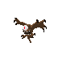

# Lesson: Digital & Serious Games

### First and Last Name: Maria Ioanna Kotrotsiou  
### University Registration Number: dpsd19057
### GitHub Personal Profile: [Personal Profile Link](https://github.com/MarigiannaKotrotsiou)
### Augmented Reality Personal Repository: [AR Link](https://marigiannakotrotsiou.github.io/Role-Playing-Game/)

# Introduction

Στα πλαίσια του μαθήματος Ψηφιακά Παιχνίδια και Παιγνιώδης Μάθηση, καλούμαστε να φτιάξουμε ένα 2D παιχνίδι ως εργασία εξαμήνου.

# Summary

Όλες οι πηγές που χρησιμοποιήθηκαν κατά την διάρκεια του εξαμήνου, για όλα τα παραδοτέα της εργασίας βρίσκονται στο τέλος, στα Sources

# 1st Deliverable

Για το πρώτο παραδοτέο, εργάστηκα εν τέλη σε σταθερό υπολογιστή που μας παρέχει το εργαστήριο της Σχολής, επείδη είχα αρκετά τεχνικά προβλήματα με το laptop και τον σταθερό μου υπολογιστή.

Από την στιγμμή που εργάστηκα από τα εργαστηρία, δεν χρειάστηκε να κατεβάσω το Unity Hub και το Unity, αν και υπήρξε μία απόπειρα να το κάνω στο σπίτι, αλλά έπρεπε να φτιάξω το προσωπικό μου link το οποίο θα οδηγεί στο παιχνίδι που θα δημουργήσω.

Αφού έφτιαξα νέο project στο Unity, ξεκίνησα να ακολούθω το tutorial που υπάρχει στην περιγραφή του παραδοτέου, και το έφτασα σε ένα "τελικό σημείο".

Τότε, αποφάσισα να ξανακάνω νέο project με δικά μου assets, τα όποια βρήκα στα link παρακάτω, και ξεκίνησα από την αρχή.

Ακολουθώντας τα tutorial, έφτασα στο σημείο όπου φτιάχνω και διακοσμώ το map, όπου ακολούθησα ένα youtube tutorial που είχε προτείνει ένας συμφοιτητής μου (βρίσκεται από κάτω), και εν τέλη μου άρεσε το Tilemap που χρησιμοποίησε στο tutorial, οπότε το κατέβασα και έκανα βάση με αυτό το pallette μου και μετά το map μου.

Υπήρχαν διάφορα προβληματάκια στην πορεία, αλλά τα περισσότερα έγιναν γιατί έπρεπε να φτιάξω το z axis στο position για να φαίνονται όλα όπως ήθελα. Στην ίδια φάση έφτιαξα και το scale του χαρακτήρα γιατί αρχικά ήταν πολύ μικρό σε σχέση με το map/tiles.

Αποφάσισα ότι ήθελα να κάνω την κάμερα να ακολουθεί τον χάρακτηρα, οπότε βρήκα ένα τουτόριαλ, που εν τέλη μας δίνεται στο επόμενο παραδοτέο, και το ακολούθησα για να το καταφέρω αυτό.

Αφού τελείωσα με όλα τα steps του παραδοτέου, ξεκίνησα να κάνω το Build βάσει του tutorial της περιγραφής. Αφού έγινε το Build, το έτρεξα για να δω πως δουλεύει μέσω της WebGl. Το πιο δύσκολο κομμάτι όλου του παραδοτέου ήταν να το ανέβασω μέσω του GitHub Desktop, όπου μου πήρε πάρα πολύ ώρα να καταλάβω πως το κάνω, αλλά εν τέλη (νομίζω) πως τα κατάφερα.

# 2nd Deliverable

Για το δεύτερο παραδοτέο, ανακάλυψα ότι το αρχείο μου είχε διαγραφτεί από τον υπολογιστή της σχολής, οπότε ξεκίνησα από την αρχή την εργασία. Σε πολλές φάσεις αυτού του παραδοτέου ξαναέφτιαξα την πίστα, οπότε αν η τελική πίστα δεν είναι ίδια με τα screenshots, κάποια στιγμή θα βαρέθηκα και θα την ξαναέφτιαξα/ διόρθωσα.

Για τα colliders, με τη βοήθεια των παρακάτω λινκ και των συμφοιτητών μου, έφτιαξα τα colliders ξεχωριστά για τα αντικείμενα που βρίσκονται στο top tilemap και ξεχωριστά για την περίμετρο της πίστας. Έκανα tilemap colliders και όχι prefabs γιατί ήταν πιο δύσκολα στην κατανόηση και δεν έβγαζα άκρη.

Επειδή όμως, είχα κάνει το Cinemachine στο προηγούμενο παραδοτέο και είχα βάλει ένα έξτρα collider για την κάμερα, μου πήρε μόνο μιάμιση εβδομάδα να καταλάβω πως αυτό το collider δε με άφηνε να κάνω τον παίχτη κουνηθεί και να κάνει αυτό που θέλω.

Για τα collectibles, βρήκα από το λινκ παρακάτω, δύο sprites για collectibles καθώς το pack με τον χαρακτήρα που βρήκα δε συμπεριλαμβανόταν. Ακολουθώντας το tutorial της περιγραφής πρόσθεσα ζωή στον χαρακτήρα.

Για το επόμενο κομμάτι του παραδοτέου, δεν έκανα damage zones αλλά πρόσθεσα enemy (το λινκ υπάρχει στο τέλος). Βάσει του tutorial, τελείωσα και αυτό το κομμάτι.

Κάνοντας τα sprite animation, μου βγήκε η πίστη. Με τη βοήθεια του tutorial της περιγραφής, από το αρχείο του lab4 του μαθήματος στο eclass και συνολικά 5 tutorials (ψέματα είπα, 8 είναι:) )(sike 12 είναι) κατάφερα να κάνω με το ζόρι να περπατάει και να είναι σε idle mode. Μετά από κόπο, τρόπο, αίμα, ιδρώτα και δάκρυα κατάφερα να φτιάξω τα transition μεταξύ των animation. Δεν είναι πολύ smooth αλλά this is the best i can do for now.

Για τον παίχτη χρησιμοποίησα τα αρχικά sprites από το pack που είχα κατεβάσει. Έφτιαξα animation για να idle mode, walk left/ right, take damage, heal, death. Το αρχικό pack δεν είχε sprite για το take damage οπότε συνδύασα frames από το death και το walk. 

Επειδή δεν είχα όμως sprites για walk up/ walk down, αρχικά απλά είχα βάλει να παίζει το animation του walk left/walk right όταν πήγαινε πάνω/ κάτω, αλλά μετά αποφάσισα να φτιάξω δικά μου sprites με το site που βρίσκεται παρακάτω, καθώς και χρησιμοποίησα και ένα online version του photoshop επειδή τα εργαστήρια της σχολής δεν έχουν. :) 

Με το ίδιo site έφτιαξα και το sprite της κίνησης που θα κάνει ο χαρακτήρας όταν ρίχνει το projectile.

Με τον ίδιο τρόπο έφτιαξα και τα animation του εχθρού. Χρησιμοποίησα τα sprites από το pack που είχα κατεβάσει. Έφτιαξα animation για flying left/ right, take damage, attack και death.

Για όλα τα animation που χρειάστηκαν να γίνουν ξανά απλά να είναι mirrored στο άξονα Χ, στο animation> Add Properties>Sprite Renderer> Flip X.

Για το projectile αντικείμενο που θα πετάει ως “σφαίρα” ο παίχτης, χρησιμοποίησα ένα sprite πέτρας που το βρήκα στο ίδιο spritesheet με τα collectibles.

Με τις οδηγίες της περιγραφής και με την βοήθεια youtube tutorial κατάφερα να κάνω τον παίχτη να ρίχνει πέτρες στον κακό:)

<strong>Ο παίχτης κάνει launch τα projectile πατώντας αριστερό click, όχι C</strong>

Το Cinemachine το είχα κάνει στο προηγούμενο παραδοτέο χωρίς να ξέρω ότι ήταν σε παρακάτω επίπεδο, ακολουθώντας το tutorial της περιγραφής.

# 3rd Deliverable 

# Conclusions

# Sources

## 
Sources for the 1st Deliverable

<a href="https://opengameart.org/"> Site1</a> / <a href="https://itch.io/game-assets/free/tag-royalty-free/tag-unity"> Site2</a>

<a href="https://opengameart.org/content/top-down-simple-tile-sets"> Αρχικό Tilemap</a> / <a href="https://maytch.itch.io/free-32x64-kanako-platformer-character-sprite-set"> Character</a>

<a href="https://www.youtube.com/watch?v=DTp5zi8_u1U"> Tilemap Tutorial</a>

## 
Sources for the 2nd Deliverable

<a href="https://www.piskelapp.com/p/create/sprite"> Create Sprites</a> / <a href="https://www.photopea.com"> Online Photoshop</a>

<a href="https://cupnooble.itch.io/sprout-lands-asset-pack"> Collectibles / Projectile Sprites</a> / <a href="https://luizmelo.itch.io/monsters-creatures-fantasy"> Enemy Sprites</a>

<a href="https://www.youtube.com/watch?v=35EjJBmgst8"> Collider Tutorial 1</a> / <a href="https://www.youtube.com/watch?v=2obtqmBHUW4&t=386s"> Collider Tutorial 2</a> / <a href="https://www.youtube.com/watch?v=Cry7FOHZGN4"> Collider Tutorial 3</a>

<a href="https://learn.unity.com/tutorial/introduction-to-sprite-animations#5fa66921edbc2a0020bcaae3
"> Sprite Animation Tutorial 1</a> / <a href="https://www.youtube.com/watch?v=hkaysu1Z-N8&t=194s"> Sprite Animation Tutorial 2</a> / <a href="https://www.youtube.com/watch?v=PnQxu9mlm6g"> Sprite Animation Tutorial 3</a> / <a href="https://www.youtube.com/watch?v=rycsXRO6rpI"> Sprite Animation Tutorial 4</a> / <a href="https://www.youtube.com/watch?v=BlalhxSTUWo"> Sprite Animation Tutorial 5</a> / <a href="https://www.youtube.com/watch?v=Fqvxbir7HlE"> Sprite Animation Tutorial 6</a> / <a href="https://www.youtube.com/watch?v=UBS6RIU99yI"> Sprite Animation Tutorial 7</a> / <a href="https://www.youtube.com/watch?v=QuDVXaSXQqI"> Sprite Animation Tutorial 8</a> / <a href="https://www.youtube.com/watch?v=Z92NAnUC2CU&list=PLBRviKraPCowhZbUfOT-XGuqktJUVybzC&index=5"> Sprite Animation Tutorial 9</a> / <a href="https://www.youtube.com/watch?v=D4qLdlUGEiA&list=PLn2yEZccJnv2BT3N7wuIcvVYF7V6lEka3&index=10
"> Sprite Animation Tutorial 10</a> / <a href="https://www.youtube.com/watch?v=eGY-srsAA2Y&list=PLn2yEZccJnv2BT3N7wuIcvVYF7V6lEka3&index=11"> Sprite Animation Tutorial 11</a> / <a href="https://www.youtube.com/watch?v=1OHkSojOL4c"> Sprite Animation Tutorial 12</a>

<a href="https://www.youtube.com/watch?v=8TqY6p-PRcs"> Projectile Tutorial</a>

