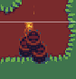

# Lesson: Digital & Serious Games

### First and Last Name: Maria Ioanna Kotrotsiou  
### University Registration Number: dpsd19057
### GitHub Personal Profile: [Personal Profile Link](https://github.com/MarigiannaKotrotsiou)
### Augmented Reality Personal Repository: [AR Link](https://marigiannakotrotsiou.github.io/Role-Playing-Game/)

# Introduction

Στα πλαίσια του μαθήματος Ψηφιακά Παιχνίδια και Παιγνιώδης Μάθηση, καλούμαστε να φτιάξουμε ένα 2D RPG παιχνίδι ως εργασία εξαμήνου.

# Summary

Όλες οι πηγές που χρησιμοποιήθηκαν κατά την διάρκεια του εξαμήνου, για όλα τα παραδοτέα της εργασίας, βρίσκονται στο τέλος, στα Sources.

# 1st Deliverable
  
## 
Getting Started & Character Controller

Για το πρώτο παραδοτέο, εργάστηκα εν τέλη σε σταθερό υπολογιστή που μας παρέχει το εργαστήριο της Σχολής, επείδη είχα αρκετά τεχνικά προβλήματα με το laptop και τον σταθερό μου υπολογιστή.

Από την στιγμμή που εργάστηκα από τα εργαστηρία, δεν χρειάστηκε να κατεβάσω το Unity Hub και το Unity, αν και υπήρξε μία απόπειρα να το κάνω στο σπίτι, αλλά έπρεπε να φτιάξω το προσωπικό μου link το οποίο θα οδηγεί στο παιχνίδι που θα δημουργήσω.

Αφού έφτιαξα νέο project στο Unity, ξεκίνησα να ακολούθω το tutorial που υπάρχει στην περιγραφή του παραδοτέου, και το έφτασα σε ένα "τελικό σημείο".

Τότε, αποφάσισα να ξανακάνω νέο project με δικά μου assets, τα όποια βρήκα στα link παρακάτω, και ξεκίνησα από την αρχή.

 
## 
Tilemaps & Decorating World

Ακολουθώντας τα tutorial, έφτασα στο σημείο όπου φτιάχνω και διακοσμώ το map, όπου ακολούθησα ένα youtube tutorial που είχε προτείνει ένας συμφοιτητής μου (βρίσκεται από κάτω), και εν τέλη μου άρεσε το Tilemap που χρησιμοποίησε στο tutorial, οπότε το κατέβασα και έκανα βάση με αυτό το pallette μου και μετά το map μου.

Υπήρχαν διάφορα προβληματάκια στην πορεία, αλλά τα περισσότερα έγιναν γιατί έπρεπε να φτιάξω το z axis στο position για να φαίνονται όλα όπως ήθελα. Στην ίδια φάση έφτιαξα και το scale του χαρακτήρα γιατί αρχικά ήταν πολύ μικρό σε σχέση με το map/tiles.

  
## 
Cinechine

Αποφάσισα ότι ήθελα να κάνω την κάμερα να ακολουθεί τον χάρακτηρα, και τυχαία βρήκα το tutorial που είναι στο επόμενο παραδοτέο.

  
## 
Build, Run and Distribute

Αφού τελείωσα με όλα τα steps του παραδοτέου, ξεκίνησα να κάνω το Build βάσει του tutorial της περιγραφής. Αφού έγινε το Build, το έτρεξα για να δω πως δουλεύει μέσω της WebGl. Το πιο δύσκολο κομμάτι όλου του παραδοτέου ήταν να το ανέβασω μέσω του GitHub Desktop, όπου μου πήρε πάρα πολύ ώρα να καταλάβω πως το κάνω, αλλά εν τέλη πως τα κατάφερα.

# 2nd Deliverable

Για το δεύτερο παραδοτέο, ανακάλυψα ότι το αρχείο μου είχε διαγραφτεί από τον υπολογιστή της σχολής, οπότε ξεκίνησα από την αρχή την εργασία.

  
## 
Blocking Movement

Για τα colliders, με τη βοήθεια των παρακάτω λινκ και των συμφοιτητών μου, έφτιαξα colliders ξεχωριστά για τα αντικείμενα που βρίσκονται στο top tilemap και ξεχωριστά για την περίμετρο της πίστας. Δεν ακολούθησα το tutorial της περιγραφής, καθώς τα prefab ήταν περίεργα στην κατανόηση και δεν έβγαζα άκρη.

 

 

  

Επειδή όμως, είχα κάνει το Cinemachine στο προηγούμενο παραδοτέο και είχα βάλει ένα έξτρα collider για την κάμερα, μου πήρε μόνο μιάμιση εβδομάδα να καταλάβω πως αυτό το collider δε με άφηνε να κάνω τον παίχτη να κουνηθεί και να κάνει αυτό που θέλω.

## 
Collectibles

 Για τα collectibles, βρήκα από το λινκ παρακάτω, δύο sprites για collectibles, καθώς στο pack με τον χαρακτήρα που βρήκα δεν συμπεριλαμβανόταν. Ακολουθώντας το tutorial της περιγραφής πρόσθεσα ζωή στον χαρακτήρα.

 
## 
Damage Zone & Enemy

Για το επόμενο κομμάτι του παραδοτέου, δεν έκανα damage zones αλλά πρόσθεσα enemy (το λινκ των sprites υπάρχει στο τέλος). Βάσει του tutorial, τελείωσα και αυτό το κομμάτι.

 

 ## 
Sprite Animation

Κάνοντας τα sprite animation, μου βγήκε η πίστη. Με την βοήθεια της περιγραφής, του αρχείου του lab 4 από το eclass, και συνολικά 5 tutorials (ψέματα, 8 είναι)(sike 11 είναι), κατάφερα να κάνω με το ζόρι να περπατάει και να είναι σε idle mode. Όμως με τρόπο, κόπο, αίμα, ιδρώτα και δάκρυα, κατάφερα να ένωσω και τα υπόλοιπα. Τα transition ανάμεσα στα animation δεν είναι τόσo smooth, αλλά take it or leave it:).

Για τον παίχτη χρησιμοποίησα τα αρχικά sprites από το pack που είχα κατεβάσει. Έφτιαξα animation για idle mode, walk left/ right, take damage, heal και death. Το αρχικό pack δεν είχε sprite για το take damage οπότε συνδύασα frames από το death και το walk.

 

Επειδή δεν είχα ούτε sprites για walk up/down, αρχικά απλά είχα βάλει να παίζει το animation του walk left/right όταν πήγαινε πάνω/ κάτω, αλλά μετά αποφάσισα να φτιάξω δικά μου sprites με το site που βρίσκεται παρακάτω, καθώς και χρησιμοποίησα ένα online version του photoshop, επειδή το εργαστήριο της σχολής δεν το έχει:).

  

Με το ίδιο site έφτιαξα και το sprite της κίνησης που θα κάνει ο χαρακτήρας όταν ρίχνει το projectile.

 

Με τον ίδιο τρόπο έφτιαξα και τα animation του εχθρού. Χρησιμοποίησα sprites από το pack που είχα κατεβάσει. Έφτιαξα animation για flying left/right, take damage, attack και death (αν και δεν τα χρησιμοποίησα όλα).

Για όλα τα animation που χρειάστηκαν να γίνουν ξανά απλά να είναι mirrored στο άξονα Χ, στο animation> Add Properties> Sprite Renderer> Flip X.

## 
Projectile

Για το projectile που θα πετάει ως "σφαίρα" ο παίχτης, χρησιμοποίησα ένα sprite πέτρας που το βρήκα στο ίδιο spritesheet με τα collectibles.

 

Aκολουθώντας τις οδηγιές του tutorial της περιγραφής (καθώς και ενώς youtube tutorial που βρήκα) έχω προσθέσει το projectile στο παιχνίδι και έχω φτιάξει όλα τα script.

 
**Ο παίχτης κάνει launch τα projectile με Left Click, όχι με το C.** 

## 
Cinamachine

Το Cinemachine το είχα κάνει στο προηγούμενο παραδοτέο χωρίς να ξέρω ότι ήταν σε παρακάτω επίπεδο, ακολουθώντας το tutorial της περιγραφής.

## 
Note

Ότι errors και προβλήματα αντιμετώπισα κατά τη διάρκεια του παραδοτέου, δεν έχω ιδέα πως τα έφτιαξα, μην ρωτήσετε.

## 
Build, Run and Distribute

Έκανα το build κανονικά και ήμουν σχεδόν έτοιμη. ΑΛΛΆ, για άλλη μια φορά το πιο δύσκολο κομμάτι ήταν να το ανεβάσω στο Github. Στην απόπειρα μου να το κάνω αυτό, κατέστρεψα όλο το Github page μου και παραλίγο να το φέρω πίσω στις εργοστασιακές ρυθμίσεις(λολ)(i wish i was lying). Μετά από μία κρίση πανικού, η οποία κράτησε τουλάχιστον 40 λεπτά, και εμενά να πατάω πράγματα χωρίς να ξέρω τι κάνω, κάπως κατάφερα φτιάξω το Github, να ανεβάσω το παιχνίδι αλλά να χάσω στο process το report του δεύτερου παραδοτέου, που ήταν σχεδόν τελειωμένο. Όλα καλά:).

  
# 3rd Deliverable

## 
Storytime

Buckle in, γιατί αυτό θα πάρει λίγη ώρα.

Ξεκινώντας δυναμικά την νέα χρονιά (αστείο), είπα και γω να ξεκινήσω το τρίτο παραδοτέο του παιχνιδιού μόλις άνοιξε η σχολή. Ξεκινώντας τα βήματα από τα tutorial, το Unity ξεκίνησε να μου κρασάρει, and it all went downhill from here. Γενικά δεν με άφηνε να συνεχίσω το progress, οπότε έπρεπε να βρω άλλη λύση. Η επόμενη μου ιδέα ήταν να περάσω σε σκληρό δίσκο τα αρχεία του παιχνιδιού, και να προσπαθήσω σε άλλον υπολογιστή (συνεχίζω να δουλεύω στα εργαστήρια της σχολής). Αρχικά, σε κανέναν άλλον υπολογιστή δεν μου άνοιγε το Unity Hub και το Unity. Μιλάω για απλό double click φάση. Έπειτα, τα αρχεία μου περάστηκαν (yay), ΑΛΛΑ το Unity Ηub δεν τα αγνώριζε (noo). Μετά, ενώ αποφάσισε να αναγνωρίσει τα αρχεία, το Unity δεν ήθελε να ανοίξει το παιχνίδι. Εμφάνιζε το opening screen του Unity αλλά μετά έκλεινε (got bamboozled).

Εκεί λοιπόν, που τα είχα παρατήσει και είχα αποδεκτεί ότι θα χρειαστεί να περάσω με εξεταστική το μάθημα, με παίρνει τηλέφωνο μια άγια συμφοιτήτρια, στις 2 το βράδυ, και μου είπε να μην τα παρατήσω και να περάσω την επόμενη μέρα από το σπίτι της να εργαστώ από τον υπολογιστή της αφού εκείνη κατάφερε να τελείωσει το παιχνίδι της, με την προϋπόθεση ότι θα περαστούν κανονικά τα αρχεία μου.

Τα αρχεία μου περάστηκαν κανονικά, thank god, αλλά το unity version ήταν διαφοερτικό, οπότε έπρεπε να κατεβάσουμε αυτό που έπρεπε. Χρειάστηκε να το googlάρουμε για να το βρούμε και σύντομα καταλάβαμε ότι όταν κάνει install με αυτόν το τρόπο version του unity δεν μπορείς να προσθέσεις modules, aka το webgl. Πανικοβληθήκαμε λίγο, αλλά για άλλη μία φορά χωρίς να ξέρω τι κάνω και τι πατάω, το έφτιαξα.

Εν τέλη τελείωσα όλα τα παραδοτέα σε υπολογιστή του εργαστηρίου, ανοίγοντας τα αρχεία μέσα από τον σκληρό δίσκο.

## 
Particles

Για τα particles, απλά ακολούθησα το tutorial της περιγραφής και έβαλα σε ένα random αντικείμενο στη πίστα μου το εφέ. Τα assets για τα particles τα βρήκα online. Γενικά, δεν ήταν κάτι περιέργο ή δύσκολο.

 

## 
User Interface - Head-up Display

Όπως αρκετοί συμφοιτητές, έτσι και γω δεν ήξερα αν έπρεπε να κάνω healthbar ή score. Οπότε έκανα και τα δύο. Με βάση ενός tutorial που βρήκα, έβαλα τον παίχτη να μάζευει κάποια collecticles (διαφορετικά από τα collectibles για να πάρει ζωή), τα οποία τα πήρα από το ίδιο spritesheet που έχω χρησιμοποίησει παραπάνω.

Για το healthbar, βρήκα τα sprites online και ακολούθησα το tutorial της περιγραφής.

## 
Dialog Raycast / Teleport

Για άλλη μία φορά, δεν ήξερα άμα έπρεπε να κάνω αλληλεπίδραση με npc και να πετάγεται κάποιο text ή να κάνει teleport σε κάποιο άλλο σημείο της πίστας.

Έκανα πρώτα τον npc. Βρήκα τα sprites online, και γρήγορα έκανα ένα idle animation. Ακολουθώντας τα βήματα του tutorial έκανα τους χαρακτήρες να αλληλεπιδράνε. Το background από το παράθυρο που εμφανίζεται όταν μιλάνε οι χαρακτήρες το έφτιαξα εγώ.

Για το teleport σε άλλο σημείο της πίστας, ακολούθησα ένα tutorial βρήκα. Τα sprite που τα έστειλε η Φαίδρα Δαμιανού.

  
## 
Audio

Βρήκα κάποια free packs με sound effects και αρχικά πρόσθεσα background audio στο main scene και στο menu scene. Ένιωσα καλά για τον εαυτό μου για ένα δευτερόλεπτο και είπα να βάλω sound effects σε ότι μπορούσα. Εν τέλη, κατάφερα να βάλω μόνο στα health collectibles και στα projectiles αλλά προσωπικά μου αρκεί.

  
## 
Menu

Για το μενού, έκανα νέο scene και ξεκίνησα να φτιάχνω το UI. Βάσει ενώς tutorial, έμαθα να φτιάχνω τα κουμπιά και το text. Έκανα κουμπί για Play, Introduction, Levels, The Story και Quit.

Έκανα τα κουμπιά να έχουν διαφορετικά χρώματα όταν είναι highlighted και selected, και γενικά έπεξα αρκετή ώρα με την τοποθεσία, το μέγεθος κτλ. Για άλλη μια φορά, ξεκάθαρα από τύχη, τα έκανα να λειτουργούν και να πηγαίνουν στις σελίδες που πρέπει.

Σε ένα νέο scene έφτιαξα και το Level 2 και καλά για να υπάρχει και να φαίνεται. Το μόνο screenshot που ξέχασα να βγάλω είναι αυτό από το δεύτερο level.

## 
Finalizing the game

Για να τελειωποιήσω το παιχνίδι έπρεπε να κάνω δύο τρία πραγματάκια ακόμα. Έβαλα συνολικά 10 ηλιοτρόπια για το score, πρόσθεσα κιάλλα collectibles και εχθρούς.

Ιδανικά, για να είναι τελείως τελειωμένο το παιχνίδι και να με ικονοποιεί, χρειάζεται κιάλλα πράγματα, τα οποία δεν τα έκανα καθώς δεν έχω χρόνο και ενέργεια για να το κάνω. Θα ήθελα το gamescene να έχει pause button που θα κάνει pause το παιχνίδι και θα έχει κάποιες επιλογές όπως να γυρισείς στο μενού, στα levels κτλ. Επίσης, θα ήθελα να βάλω sound effects σε όλες τις κινήσεις. Θα ήθελα να έχει winning και gameover σκηνή. Αλλά τι να κάνουμε.

## 
Build, Run and Distribute
   

Περιέργως ανέβηκε κανονικά στο github.

# Conclusions

Δεν πέρασα καλά κατά τη διάρκεια αυτής της εργασίας.

# Sources

## 
Sources for the 1st Deliverable

<a href="https://opengameart.org/"> Site1</a> / <a href="https://itch.io/game-assets/free/tag-royalty-free/tag-unity"> Site2</a>

<a href="https://opengameart.org/content/top-down-simple-tile-sets"> Αρχικό Tilemap</a> / <a href="https://maytch.itch.io/free-32x64-kanako-platformer-character-sprite-set"> Character</a>

<a href="https://www.youtube.com/watch?v=DTp5zi8_u1U"> Tilemap Tutorial</a>

<a href="https://learn.unity.com/tutorial/camera-cinemachine?uv=2020.3&projectId=5c6166dbedbc2a0021b1bc7c#"> How to make the camera follow the player.</a>

  
 ## 
Sources for the 2nd Deliverable
 

<a href="https://cupnooble.itch.io/sprout-lands-asset-pack"> Collectible / Projectile Spritesheet</a> / <a href="https://luizmelo.itch.io/monsterscreatures-fantasy"> Enemy Sprites</a>

<a href="https://www.youtube.com/watch?v=35EjJBmgst8"> Collider Tutorial 1</a> / <a href="https://www.youtube.com/watch?v=2obtqmBHUW4&t=386s"> Collider Tutorial 2</a> / <a href="https://www.youtube.com/watch?v=Cry7FOHZGN4"> Collider Tutorial 3</a>

<a href="https://www.piskelapp.com/p/create/sprite"> Sprite Creation</a> / <a href="https://www.photopea.com"> Online Photoshop</a>

  

<a href="https://www.youtube.com/watch?v=hkaysu1Z-N8&t=194s"> Sprite Animation Tutorial 1</a> / <a href="https://www.youtube.com/watch?v=PnQxu9mlm6g"> Sprite Animation Tutorial 2</a> / <a href="https://www.youtube.com/watch?v=rycsXRO6rpI"> Sprite Animation Tutorial 3</a> / <a href="https://www.youtube.com/watch?v=BlalhxSTUWo"> Sprite Animation Tutorial 4</a> / <a href="https://www.youtube.com/watch?v=Fqvxbir7HlE">Sprite Animation Tutorial 5</a> / <a href="https://www.youtube.com/watch?v=UBS6RIU99yI"> Sprite Animation Tutorial 6</a> / <a href="https://www.youtube.com/watch?v=QuDVXaSXQqI"> Sprite Animation Tutorial 7</a> / <a href="https://learn.unity.com/tutorial/introduction-to-sprite-animations#5fa66921edbc2a0020bcaae3"> Sprite Animation Tutorial 8</a> / <a href="https://www.youtube.com/watch?v=D4qLdlUGEiA&list=PLn2yEZccJnv2BT3N7wuIcvVYF7V6lEka3&index=10"> Sprite Animation Tutorial 9</a> / <a href="https://www.youtube.com/watch?v=eGY-srsAA2Y&list=PLn2yEZccJnv2BT3N7wuIcvVYF7V6lEka3&index=11"> Sprite Animation Tutorial 10</a> / <a href="https://www.youtube.com/watch?v=1OHkSojOL4c"> Sprite Animation Tutorial 11</a>

<a href="https://www.youtube.com/watch?v=8TqY6p-PRcs"> Projectile Tutorial 1</a> / <a href="https://www.youtube.com/watch?v=Z92NAnUC2CU&list=PLBRviKraPCowhZbUfOT-XGuqktJUVybzC&index=5"> Projectile Tutorial 2</a>

 ## 
Sources for the 3rd Deliverable
 
 <a href="https://github.com/FaidraDamianou"> Faidra's Profile</a>

 
<a href="https://ranjansikand.itch.io/pixel-health"> Healthbar Sprites</a> / <a href="https://ranjansikand.itch.io/pixel-health](https://legnops.itch.io/red-hood-character"> NPC Sprites</a> / <a href="https://brullov.itch.io/fire-animation"> Fire Sprites</a>

<a href="https://www.youtube.com/watch?v=pf8jKN2Y1BM&list=PLBRviKraPCowhZbUfOT-XGuqktJUVybzC&index=7"> Particles Tutorial</a>

<a href="https://www.freepik.com/premium-vector/pixel-art-landscape-pine-forest-mountains-with-lake-clouds-8-bit-game-background_27462193.htm?fbclid=IwAR2SuIydqaFda_FSNjdh89BGBYnVOiJtY5JGySUaX41eRsrz9XmK_2d4Q2Q#query=pixel%20art%20forest&position=33&from_view=keyword"> Background Picture</a>

<a href="https://www.youtube.com/watch?v=cOW_T3i4_kk&t=316s&fbclid=IwAR2yUgUarR2LIccTPmtHTPM6LA754AaIsZnXLMpXp1NXlueroOtmOo2L1aE"> Score Tutorial</a>

<a href="https://www.youtube.com/watch?v=8F0Egqqenvw&list=PLBRviKraPCowhZbUfOT-XGuqktJUVybzC&index=8"> Head-Up Tutorial</a>

<a href="https://www.youtube.com/watch?v=-GWjA6dixV4&fbclid=IwAR3fezYlIkhzUq2s7APfXnLbAK4tCxA4yoVytQ4IINoe5M2adnVRek-otXc"> Menu Tutorial</a>

<a href="https://www.youtube.com/watch?v=9JvZwMmEydQ&t=95s&fbclid=IwAR2Pfu9sz76H-pw3PPKf4SuLAf4MAHYWGcSX2Ea0K3juT85WFCDwh4gnjr8"> Teleport Tutorial 1</a> / <a href="https://www.youtube.com/watch?v=evDKHClDxU8"> Teleport Tutorial 2</a>

<a href="VymAi1JYI3yrlaEkU1DDOk7k36PMOHjV55T68jVA5A"> Background Music Site</a> / <a href="https://kronbits.itch.io/freesfx?fbclid=IwAR1X66xCFX7qD0ob_oa5qNVoP8X5cVWkRWJqgY2lieCEcYRjOowZiA0GLAw"> Sound Effects Site</a>

<a href="https://www.youtube.com/watch?v=HVkuRbE0Zck&list=PLBRviKraPCowhZbUfOT-XGuqktJUVybzC&index=9"> Audio Tutorial</a>

