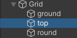

# Lesson: Digital & Serious Games

### First and Last Name: Maria Ioanna Kotrotsiou  
### University Registration Number: dpsd19057
### GitHub Personal Profile: [Personal Profile Link](https://github.com/MarigiannaKotrotsiou)
### Augmented Reality Personal Repository: [AR Link](https://marigiannakotrotsiou.github.io/Role-Playing-Game/)

# Introduction

Στα πλαίσια του μαθήματος Ψηφιακά Παιχνίδια και Παιγνιώδης Μάθηση, καλούμαστε να φτιάξουμε ένα 2D παιχνίδι ως εργασία εξαμήνου.

# Summary

Όλες οι πηγές που χρησιμοποιήθηκαν κατά την διάρκεια του εξαμήνου, για όλα τα παραδοτέα της εργασίας βρίσκονται στο τέλος, στα Sources

# 1st Deliverable
  
## 
Getting Started & Character Controller

Για το πρώτο παραδοτέο, εργάστηκα εν τέλη σε σταθερό υπολογιστή που μας παρέχει το εργαστήριο της Σχολής, επείδη είχα αρκετά τεχνικά προβλήματα με το laptop και τον σταυερό μου υπολογιστή.

Από την στιγμμή που εργάστηκα από τα εργαστηρία, δεν χρειάστηκε να κατεβάσω το Unity Hub και το Unity, αν και υπήρξε μία απόπειρα να το κάνω στο σπίτι, αλλά έπρεπε να φτιάξω το προσωπικό μου link το οποίο θα οδηγεί στο παιχνίδι που θα δημουργήσω.

Αφού έφτιαξα νέο project στο Unity, ξεκίνησα να ακολούθω το tutorial που υπάρχει στην περιγραφή του παραδοτέου, και το έφτασα σε ένα "τελικό σημείο".

Τότε, αποφάσισα να ξανακάνω νέο project με δικά μου assets, τα όποια βρήκα στα link παρακάτω, και ξεκίνησα από την αρχή.

 
## 
Tilemaps & Decorating World

Ακολουθώντας τα tutorial, έφτασα στο σημείο όπου φτιάχνω και διακοσμώ το map, όπου ακολούθησα ένα youtube tutorial που είχε προτείνει ένας συμφοιτητής μου (βρίσκεται από κάτω), και εν τέλη μου άρεσε το Tilemap που χρησιμοποίησε στο tutorial, οπότε το κατέβασα και έκανα βάση με αυτό το pallette μου και μετά το map μου.

Υπήρχαν διάφορα προβληματάκια στην πορεία, αλλά τα περισσότερα έγιναν γιατί έπρεπε να φτιάξω το z axis στο position για να φαίνονται όλα όπως ήθελα. Στην ίδια φάση έφτιαξα και το scale του χαρακτήρα γιατί αρχικά ήταν πολύ μικρό σε σχέση με το map/tiles.

  
## 
Cinechine

Αποφάσισα ότι ήθελα να κάνω την κάμερα να ακολουθεί τον χάρακτηρα, και τυχαία βρήκα το tutorial που είναι στο παρακάτω παραδοτέο.

  
## 
Build, Run and Distribute

Αφού τελείωσα με όλα τα steps του παραδοτέου, ξεκίνησα να κάνω το Build βάσει του tutorial της περιγραφής. Αφού έγινε το Build, το έτρεξα για να δω πως δουλεύει μέσω της WebGl. Το πιο δύσκολο κομάτι όλου του παραδοτέου ήταν να το ανέβασω μέσω του GitHub Desktop, όπου μου πήρε πάρα πολύ ώρα να καταλάνω πως το κάνω, αλλά εν τέλη (νομίζω) πως τα κατάφερα.

# 2nd Deliverable

Για το δεύτερο παραδοτέο, ανακάλυψα ότι το αρχείο μου είχε διαγραφτεί από τον υπολογιστή της σχολής, οπότε ξεκίνησα από την αρχή την εργασία

  
## 
Blocking Movement

Για τα colliders, με τη βοήθεια των παρακάτω λινκ και των συμφοιτητών μου, έφτιαξα colliders ξεχωριστά για τα αντικείμενα που βρίσκονται στο top tilemap και ξεχωριστά για την περίμετρο της πίστας. Δεν ακολούθησα το tutorial της περιγραφής, καθώς τα prefab ήταν περίεργα στην κατανόηση και δεν έβγαζα άκρη.

 

 

  

Επειδή όμως, είχα κάνει το Cinemachine στο προηγούμενο παραδοτέο και είχα βάλει ένα έξτρα collider για την κάμερα, μου πήρε μόνο μιάμιση εβδομάδα να καταλάβω πως αυτό το collider δε με άφηνε να κάνω τον παίχτη να κουνηθεί και να κάνει αυτό που θέλω

## 
Collectibles

 Για τα collectibles, βρήκα από το λινκ παρακάτω, δύο sprites για collectibles, καθώς στο pack με τον χαρακτήρα που βρήκα δεν συμπεριλαμβανόταν. Ακολουθώντας το tutorial της περιγραφής πρόσθεσα ζωή στον χαρακτήρα.

 
## 
Damage Zone & Enemy

Για το επόμενο κομμάτι του παραδοτέου, δεν έκανα damage zones αλλά πρόσθεσα enemy (το λινκ των sprites υπάρχει στο τέλος). Βάσει του tutorial, τελείωσα και αυτό το κομμάτι.

 

 ## 
Sprite Animation

Κάνοντας τα sprite animation, μου βγήκε η πίστη. Με την βοήθεια της περιγραφής, του αρχείου του lab 4 από το eclass, και συνολικά 5 tutorials (ψέματα, 8 είναι)(sike 11 είναι), κατάφερα να κάνω με το ζόρι να περπατάει και να είναι σε idle mode. Όμως με τρόπο, κόπο, αίμα, ιδρώτα και δάκρυα, κατάφερα να ένωσω και τα υπόλοιπα. Τα transition ανάμεσα στα animation δεν είναι τόσo smooth αλλά take it or leave it:).

Για τον παίχτη χρησιμοποίησα τα αρχικά sprites από το pack που είχα κατεβάσει. Έφτιαξα animation για idle mode, walk left/ right, take damage, heal και death. Το αρχικό pack δεν είχε sprite για το take damage οπότε συνδύασα frames από το death και το walk.

 

Επειδή δεν είχα ούτε sprites για walk up/down, αρχικά απλά είχα βάλει να παίζει το animation του walk left/right όταν πήγαινε πάνω/ κάτω, αλλά μετά αποφάσισα να φτιάξω δικά μου sprites με το site που βρίσκεται παρακάτω, καθώς και χρησιμοποίησα ένα online version του photoshop, επειδή το εργαστήριο της σχολής δεν το έχει:).

  

Με το ίδιο site έφτιαξα και το sprite της κίνησης που θα κάνει ο χαρακτήρας όταν ρίχνει το projectile.

 

Με τον ίδιο τρόπο έφτιαξα και τα animation του εχθρού. Χρησιμοποίησα sprites από το pack που είχα κατεβάσει. Έφτιαξα animation για flying left/right, take damage, attack και death (αν και δεν τα χρησιμοποίησα όλα).

Για όλα τα animation που χρειάστηκαν να γίνουν ξανά απλά να είναι mirrored στο άξονα Χ, στο animation> Add Properties> Sprite Renderer> Flip X.

## 
Projectile

Για το projectile που θα πετάει ως "σφαίρα" ο παίχτης, χρησιμοποίησα ένα sprite πέτρας που το βρήκα στο ίδιο spritesheet με τα collectibles.

 

Aκολουθώντας τις οδηγιές του tutorial της περιγραφής (καθώς και ενώς youtube tutorial που βρήκα) έχω προσθέσει το projectile στο παιχνίδι και έχω φτιάξει όλα τα script.

 

Ο παίχτης κάνει launch τα projectile με Left Click, όχι με το C

## 
Cinamachine

Το Cinemachine το είχα κάνει στο προηγούμενο παραδοτέο χωρίς να ξέρω ότι ήταν σε παρακάτω επίπεδο, ακολουθώντας το tutorial της περιγραφής.

  
# 3rd Deliverable 

# Conclusions

# Sources

## 
Sources for the 1st Deliverable

<a href="https://opengameart.org/"> Site1</a> / <a href="https://itch.io/game-assets/free/tag-royalty-free/tag-unity"> Site2</a>

<a href="https://opengameart.org/content/top-down-simple-tile-sets"> Αρχικό Tilemap</a> / <a href="https://maytch.itch.io/free-32x64-kanako-platformer-character-sprite-set"> Character</a>

<a href="https://www.youtube.com/watch?v=DTp5zi8_u1U"> Tilemap Tutorial</a>

<a href="https://learn.unity.com/tutorial/camera-cinemachine?uv=2020.3&projectId=5c6166dbedbc2a0021b1bc7c#"> How to make the camera follow the player.</a>

  
 ## 
Sources for the 2nd Deliverable
 

<a href="https://cupnooble.itch.io/sprout-lands-asset-pack"> Collectible / Projectile Spritesheet</a> / <a href="https://luizmelo.itch.io/monsterscreatures-fantasy"> Enemy Sprites</a>

<a href="https://www.youtube.com/watch?v=35EjJBmgst8"> Collider Tutorial 1</a> / <a href="https://www.youtube.com/watch?v=2obtqmBHUW4&t=386s"> Collider Tutorial 2</a> / <a href="https://www.youtube.com/watch?v=Cry7FOHZGN4"> Collider Tutorial 3</a>

<a href="https://www.piskelapp.com/p/create/sprite"> Sprite Creation</a> / <a href="https://www.photopea.com"> Online Photoshop</a>

  

<a href="https://www.youtube.com/watch?v=hkaysu1Z-N8&t=194s"> Sprite Animation Tutorial 1</a> / <a href="https://www.youtube.com/watch?v=PnQxu9mlm6g"> Sprite Animation Tutorial 2</a> / <a href="https://www.youtube.com/watch?v=rycsXRO6rpI"> Sprite Animation Tutorial 3</a> / <a href="https://www.youtube.com/watch?v=BlalhxSTUWo"> Sprite Animation Tutorial 4</a> / <a href="https://www.youtube.com/watch?v=Fqvxbir7HlE">Sprite Animation Tutorial 5</a> / <a href="https://www.youtube.com/watch?v=UBS6RIU99yI"> Sprite Animation Tutorial 6</a> / <a href="https://www.youtube.com/watch?v=QuDVXaSXQqI"> Sprite Animation Tutorial 7</a> / <a href="https://learn.unity.com/tutorial/introduction-to-sprite-animations#5fa66921edbc2a0020bcaae3"> Sprite Animation Tutorial 8</a> / <a href="https://www.youtube.com/watch?v=D4qLdlUGEiA&list=PLn2yEZccJnv2BT3N7wuIcvVYF7V6lEka3&index=10"> Sprite Animation Tutorial 9</a> / <a href="https://www.youtube.com/watch?v=eGY-srsAA2Y&list=PLn2yEZccJnv2BT3N7wuIcvVYF7V6lEka3&index=11"> Sprite Animation Tutorial 10</a> / <a href="https://www.youtube.com/watch?v=1OHkSojOL4c"> Sprite Animation Tutorial 11</a>

<a href="https://www.youtube.com/watch?v=8TqY6p-PRcs"> Projectile Tutorial 1</a> / <a href="https://www.youtube.com/watch?v=Z92NAnUC2CU&list=PLBRviKraPCowhZbUfOT-XGuqktJUVybzC&index=5"> Projectile Tutorial 2</a>

