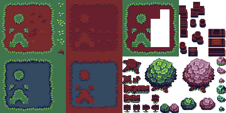

# Lesson: Digital & Serious Games

### First and Last Name: Maria Ioanna Kotrotsiou  
### University Registration Number: dpsd19057
### GitHub Personal Profile: [Personal Profile Link](https://github.com/MarigiannaKotrotsiou)
### Augmented Reality Personal Repository: [AR Link](https://marigiannakotrotsiou.github.io/Role-Playing-Game/)

# Introduction

Στα πλαίσια του μαθήματος Ψηφιακά Παιχνίδια και Παιγνιώδης Μάθηση, καλούμαστε να φτιάξουμε ένα 2D παιχνίδι ως εργασία εξαμήνου.

# Summary

Όλες οι πηγές που χρησιμοποιήθηκαν κατά την διάρκεια του εξαμήνου, για όλα τα παραδοτέα της εργασίας βρίσκονται στο τέλος, στα Sources

# 1st Deliverable

Για το πρώτο παραδοτέο, εργάστηκα εν τέλη σε σταθερό υπολογιστή που μας παρέχει το εργαστήριο της Σχολής, επείδη είχα αρκετά τεχνικά προβλήματα με το laptop και τον σταυερό μου υπολογιστή.

Από την στιγμμή που εργάστηκα από τα εργαστηρία, δεν χρειάστηκε να κατεβάσω το Unity Hub και το Unity, αν και υπήρξε μία απόπειρα να το κάνω στο σπίτι, αλλά έπρεπε να φτιάξω το προσωπικό μου link το οποίο θα οδηγεί στο παιχνίδι που θα δημουργήσω.

Αφού έφτιαξα νέο project στο Unity, ξεκίνησα να ακολούθω το tutorial που υπάρχει στην περιγραφή του παραδοτέου, και το έφτασα σε ένα "τελικό σημείο".

Τότε, αποφάσισα να ξανακάνω νέο project με δικά μου assets, τα όποια βρήκα στα link παρακάτω, και ξεκίνησα από την αρχή.

Ακολουθώντας τα tutorial, έφτασα στο σημείο όπου φτιάχνω και διακοσμώ το map, όπου ακολούθησα ένα youtube tutorial που είχε προτείνει ένας συμφοιτητής μου (βρίσκεται από κάτω), και εν τέλη μου άρεσε το Tilemap που χρησιμοποίησε στο tutorial, οπότε το κατέβασα και έκανα βάση με αυτό το pallette μου και μετά το map μου.

Υπήρχαν διάφορα προβληματάκια στην πορεία, αλλά τα περισσότερα έγιναν γιατί έπρεπε να φτιάξω το z axis στο position για να φαίνονται όλα όπως ήθελα. Στην ίδια φάση έφτιαξα και το scale του χαρακτήρα γιατί αρχικά ήταν πολύ μικρό σε σχέση με το map/tiles.

Αποφάσισα ότι ήθελα να κάνω την κάμερα να ακολουθεί τον χάρακτηρα, οπότε βρήκα ένα τουτόριαλ και το ακολούθησα για να το καταφέρω αυτό (δεν ξέρω αν αυτό το step υπάρχει σε παρακάτω παραδοτέο).

Αφού τελείωσα με όλα τα steps του παραδοτέου, ξεκίνησα να κάνω το Build βάσει του tutorial της περιγραφής. Αφού έγινε το Build, το έτρεξα για να δω πως δουλεύει μέσω της WebGl. Το πιο δύσκολο κομάτι όλου του παραδοτέου ήταν να το ανέβασω μέσω του GitHub Desktop, όπου μου πήρε πάρα πολύ ώρα να καταλάνω πως το κάνω, αλλά εν τέλη (νομίζω) πως τα κατάφερα.

# 2nd Deliverable

# 3rd Deliverable 

# Conclusions

# Sources

## 
Sources for the 1st Deliverable

<a href="https://opengameart.org/"> Site1</a> / <a href="https://itch.io/game-assets/free/tag-royalty-free/tag-unity"> Site2</a>

<a href="https://opengameart.org/content/top-down-simple-tile-sets"> Αρχικό Tilemap</a> / <a href="https://maytch.itch.io/free-32x64-kanako-platformer-character-sprite-set"> Character</a>

<a href="https://www.youtube.com/watch?v=DTp5zi8_u1U"> Tilemap Tutorial</a>

<a href="https://learn.unity.com/tutorial/camera-cinemachine?uv=2020.3&projectId=5c6166dbedbc2a0021b1bc7c#"> How to make the camera follow the player.</a>

